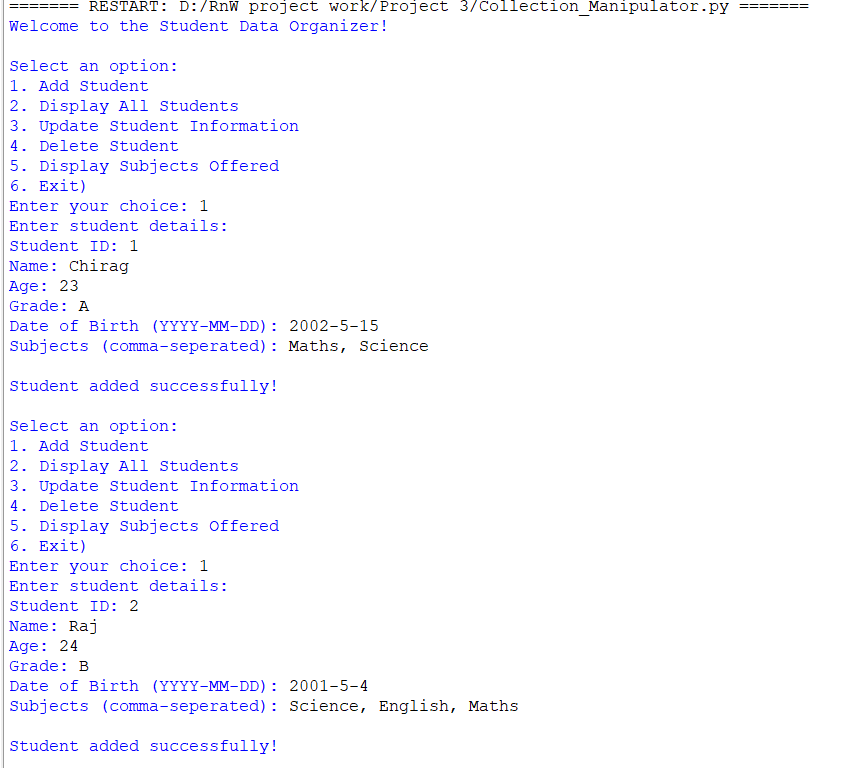
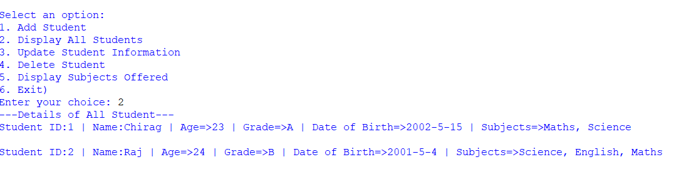
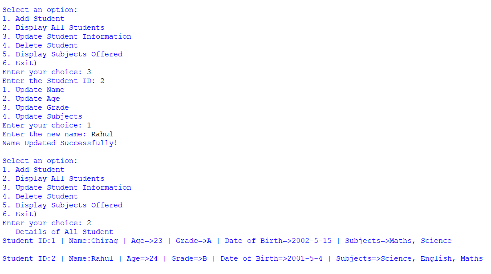
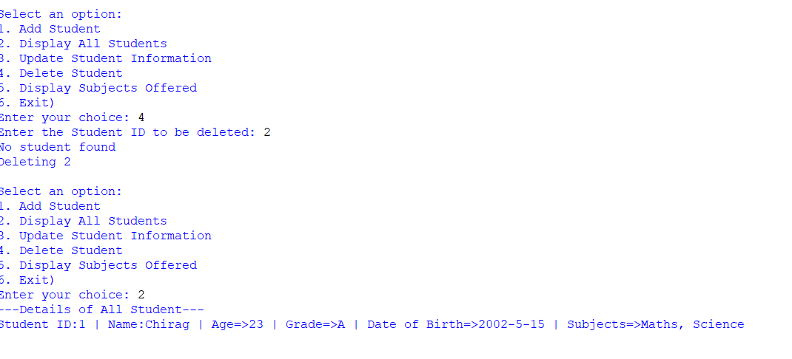

# 📚 Student Data Organizer (Collection Manipulator)

A **menu-driven Python console application** to manage student records using core Python data structures such as **lists, dictionaries, sets, and control flow**.
---

## 🚀 Features

- ➕ Add student details
- 📋 Display all students
- ✏️ Update student information
- ❌ Delete a student by ID
- 📘 Display all **unique subjects offered**
- 🔁 Continuous menu until exit

---

## 🛠️ Technologies Used

- **Python 3.10+**
  - Lists
  - Dictionaries
  - Sets
  - `match-case` statements
  - Loops and conditionals

---

## 🧾 Menu Options

```
1. Add Student
2. Display All Students
3. Update Student Information
4. Delete Student
5. Display Subjects Offered
6. Exit
---

## 🧪 Output Screenshots





---

## 🎯 Learning Outcomes

* Practical understanding of Python collections
* CRUD operations without external libraries
* Menu-driven program design
* Data validation and search logic

---

## 🤝 Author

**Chirag Modi**